## Setup


## Reading and summarizing maf tools

### Reading MAF files

The ```read.maf``` function reads MAF files, summarizes it in various ways, and stores it as an MAF object. 


```r
library(maftools)
clinical.data = read.table("tcga_laml.annot.tsv",sep="\t", header = TRUE) #read in metadata
laml.maf = read.maf(maf = "tcga_laml.maf.gz", clinicalData = clinical.data) #create a MAF object
```

```
## -Reading
## -Validating
## -Silent variants: 475 
## -Summarizing
## -Processing clinical data
## -Finished in 0.228s elapsed (0.334s cpu)
```

### MAF object

The summarized MAF file is stored of a MAF object. The MAF object contains the main maf filem summarized data, and any associated sample annotations, 


```r
#Typing laml shows basic summary of MAF file.
laml.maf
```

```
## An object of class  MAF 
##                    ID          summary  Mean Median
##  1:        NCBI_Build               37    NA     NA
##  2:            Center genome.wustl.edu    NA     NA
##  3:           Samples              193    NA     NA
##  4:            nGenes             1241    NA     NA
##  5:   Frame_Shift_Del               52 0.269      0
##  6:   Frame_Shift_Ins               91 0.472      0
##  7:      In_Frame_Del               10 0.052      0
##  8:      In_Frame_Ins               42 0.218      0
##  9: Missense_Mutation             1342 6.953      7
## 10: Nonsense_Mutation              103 0.534      0
## 11:       Splice_Site               92 0.477      0
## 12:             total             1732 8.974      9
```


```r
#Shows sample summry.
getSampleSummary(laml.maf)
```

```
##      Tumor_Sample_Barcode Frame_Shift_Del Frame_Shift_Ins In_Frame_Del
##   1:         TCGA-AB-3009               0               5            0
##   2:         TCGA-AB-2807               1               0            1
##   3:         TCGA-AB-2959               0               0            0
##   4:         TCGA-AB-3002               0               0            0
##   5:         TCGA-AB-2849               0               1            0
##  ---                                                                  
## 189:         TCGA-AB-2942               0               0            0
## 190:         TCGA-AB-2946               0               0            0
## 191:         TCGA-AB-2954               0               0            0
## 192:         TCGA-AB-2982               0               0            0
## 193:         TCGA-AB-2903               0               0            0
##      In_Frame_Ins Missense_Mutation Nonsense_Mutation Splice_Site total
##   1:            1                25                 2           1    34
##   2:            0                16                 3           4    25
##   3:            0                22                 0           1    23
##   4:            0                15                 1           5    21
##   5:            0                16                 1           2    20
##  ---                                                                   
## 189:            1                 0                 0           0     1
## 190:            0                 1                 0           0     1
## 191:            0                 1                 0           0     1
## 192:            0                 1                 0           0     1
## 193:            0                 0                 0           0     0
```

```r
#Shows gene summary.
getGeneSummary(laml.maf)
```

```
##       Hugo_Symbol Frame_Shift_Del Frame_Shift_Ins In_Frame_Del In_Frame_Ins
##    1:        FLT3               0               0            1           33
##    2:      DNMT3A               4               0            0            0
##    3:        NPM1               0              33            0            0
##    4:        IDH2               0               0            0            0
##    5:        IDH1               0               0            0            0
##   ---                                                                      
## 1237:      ZNF689               0               0            0            0
## 1238:      ZNF75D               0               0            0            0
## 1239:      ZNF827               1               0            0            0
## 1240:       ZNF99               0               0            0            0
## 1241:        ZPBP               0               0            0            0
##       Missense_Mutation Nonsense_Mutation Splice_Site total MutatedSamples
##    1:                15                 0           3    52             52
##    2:                39                 5           6    54             48
##    3:                 1                 0           0    34             33
##    4:                20                 0           0    20             20
##    5:                18                 0           0    18             18
##   ---                                                                     
## 1237:                 1                 0           0     1              1
## 1238:                 1                 0           0     1              1
## 1239:                 0                 0           0     1              1
## 1240:                 1                 0           0     1              1
## 1241:                 1                 0           0     1              1
##       AlteredSamples
##    1:             52
##    2:             48
##    3:             33
##    4:             20
##    5:             18
##   ---               
## 1237:              1
## 1238:              1
## 1239:              1
## 1240:              1
## 1241:              1
```

```r
#shows clinical data associated with samples
getClinicalData(laml.maf)
```

```
##      Tumor_Sample_Barcode FAB_classification days_to_last_followup
##   1:         TCGA-AB-2802                 M4                   365
##   2:         TCGA-AB-2803                 M3                   792
##   3:         TCGA-AB-2804                 M3                  2557
##   4:         TCGA-AB-2805                 M0                   577
##   5:         TCGA-AB-2806                 M1                   945
##  ---                                                              
## 189:         TCGA-AB-3007                 M3                  1581
## 190:         TCGA-AB-3008                 M1                   822
## 191:         TCGA-AB-3009                 M4                   577
## 192:         TCGA-AB-3011                 M1                  1885
## 193:         TCGA-AB-3012                 M3                  1887
##      Overall_Survival_Status
##   1:                       1
##   2:                       1
##   3:                       0
##   4:                       1
##   5:                       1
##  ---                        
## 189:                       0
## 190:                       1
## 191:                       1
## 192:                       0
## 193:                       0
```

```r
#Shows all fields in MAF
getFields(laml.maf)
```

```
##  [1] "Hugo_Symbol"            "Entrez_Gene_Id"         "Center"                
##  [4] "NCBI_Build"             "Chromosome"             "Start_Position"        
##  [7] "End_Position"           "Strand"                 "Variant_Classification"
## [10] "Variant_Type"           "Reference_Allele"       "Tumor_Seq_Allele1"     
## [13] "Tumor_Seq_Allele2"      "Tumor_Sample_Barcode"   "Protein_Change"        
## [16] "i_TumorVAF_WU"          "i_transcript_name"
```

```r
#Writes maf summary to an output file with basename laml.
write.mafSummary(maf = laml.maf, basename = 'laml.maf')
```

## Visualization

### Plot MAF summary

To plot the MAF summary we use ```plotmafsummary```, this displays a number of variants in each sample in a stacked barplot format. It also shows variant types as a boxplot summarized by Variant_classification. You can use ```mafbarplot``` for a minimal barplot of mutated genes.


```r
plotmafSummary(maf = laml.maf, rmOutlier = TRUE, addStat = 'median', dashboard = TRUE, titvRaw = FALSE)
```

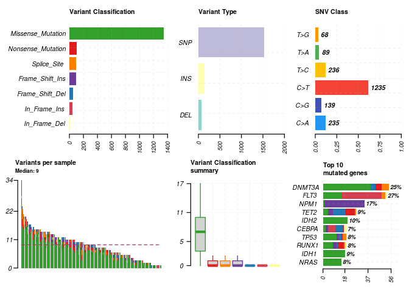<!-- -->

### Oncoplots

A better representation of a MAF file can be shown as oncoplots, which are also known as waterfall plots. NOTE: Variants that are annotate as ```Multi_hit``` are genes which have mutated more than once in the same sample.


```r
#oncoplot for top ten mutated genes.
oncoplot(maf = laml.maf, top = 10)
```

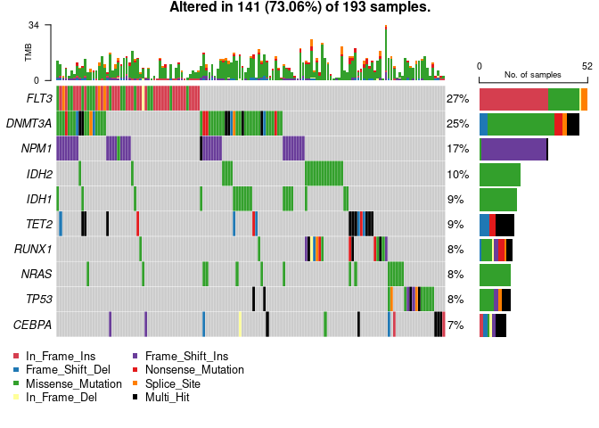<!-- -->

### Transition and Transversions

The ```titv``` function classifies SNPs into transitions and transversions and will return a list of various summarized tables. This summarized data can be visualized as a boxplot showing the overall distribution of six different conversions and as a stacked barplot that shows the fraction of conversions in each sample. 


```r
laml.titv = titv(maf = laml.maf, plot = FALSE, useSyn = TRUE)
#plot titv summary
plotTiTv(res = laml.titv)
```

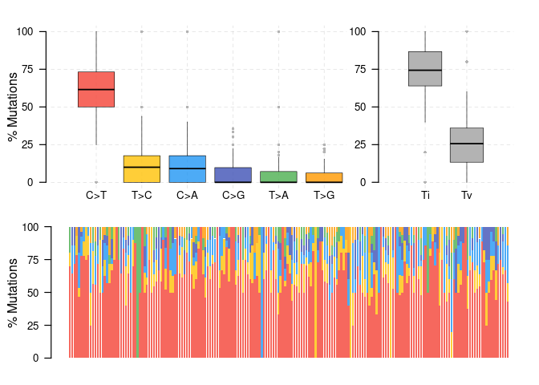<!-- -->

### Lollipop plots for amino acid changes

The ```lollipopPlot``` function requires amino acid changes dome to the MAf file. Although, MAF files do not have clear guidelines on naming amino acid changes, there are different studies with different field names for amino acid changes. Defaultly, ```lollipopPlot``` looks for the column ```AAChnage```, and if it is not found, it will print out all available fields with a warning message. As in the example below, the MAF file contains amino acid chnages under a field called 'Protein_Change". This can be manually specified using the argument ```AACol```. By defualt ```lollipopPlot``` will use the longest isoform of the gene.


```r
#lollipop plot for DNMT3A, which is one of the most frequent mutated gene in Leukemia.
lollipopPlot(
  maf = laml.maf,
  gene = 'DNMT3A',
  AACol = 'Protein_Change',
  showMutationRate = TRUE,
  labelPos = 882
)
```

```
##      HGNC refseq.ID protein.ID aa.length
## 1: DNMT3A NM_022552  NP_072046       912
## 2: DNMT3A NM_153759  NP_715640       723
## 3: DNMT3A NM_175629  NP_783328       912
```

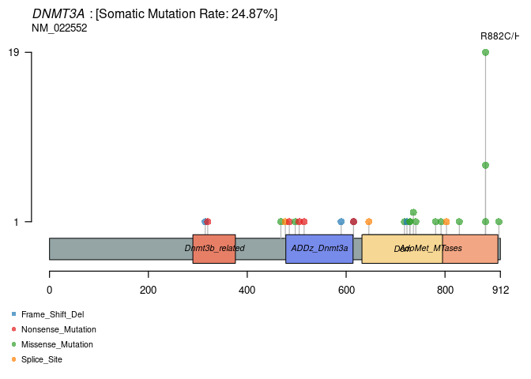<!-- -->

The function ```plotProtein``` can draw the general protein domains.


```r
plotProtein(gene = "TP53", refSeqID = "NM_000546")
```

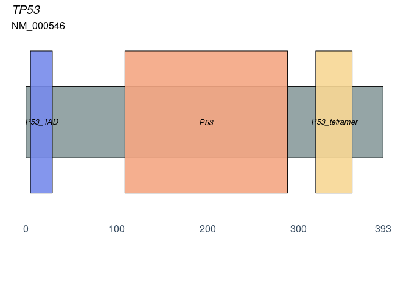<!-- -->

### Rainfall plots

Cancer genomes are characterized by genomic loci that have localized hyper-mutations, this especially robust in solid tumors. These hyper mutated genomic regions can be visualized by plotting the inter variant distance on a linear genomic scale. These kinds of plots are called rainfall plots and can be drawn by using the ```rainfallPlot``` function. If ```detectChangePoints``` is set to TRUE, then ```rainfallPlot``` also highlights regions where potential changes of inter-event distances are located. Genomic segments containing six or more consecutive mutations with an average inter-mutation distance of than than or equal to 1,00 bo are known as "kataegis". 


```r
brca <- system.file("extdata", "brca.maf.gz", package = "maftools")
brca = read.maf(maf = brca, verbose = FALSE)
rainfallPlot(maf = brca, detectChangePoints = TRUE, pointSize = 0.4)
```

```
##    Chromosome Start_Position End_Position nMuts Avg_intermutation_dist Size
## 1:          8       98129348     98133560     7               702.0000 4212
## 2:          8       98398549     98403536     9               623.3750 4987
## 3:          8       98453076     98456466     9               423.7500 3390
## 4:          8      124090377    124096810    22               306.3333 6433
## 5:         12       97436055     97439705     7               608.3333 3650
## 6:         17       29332072     29336153     8               583.0000 4081
##    Tumor_Sample_Barcode C>G C>T
## 1:         TCGA-A8-A08B   4   3
## 2:         TCGA-A8-A08B   1   8
## 3:         TCGA-A8-A08B   1   8
## 4:         TCGA-A8-A08B   1  21
## 5:         TCGA-A8-A08B   4   3
## 6:         TCGA-A8-A08B   4   4
```

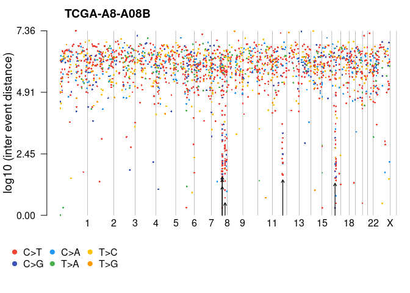<!-- -->

### Compare mutation load against TCGA cohorts

The function ```tcgaCompare``` uses mutation load form TCGA MC3 for comparing mutation burden against 33 TCGA cohorts.


```r
laml.mutload = tcgaCompare(maf = laml.maf, cohortName = 'Example-LAML', logscale = TRUE, capture_size = 50)
```

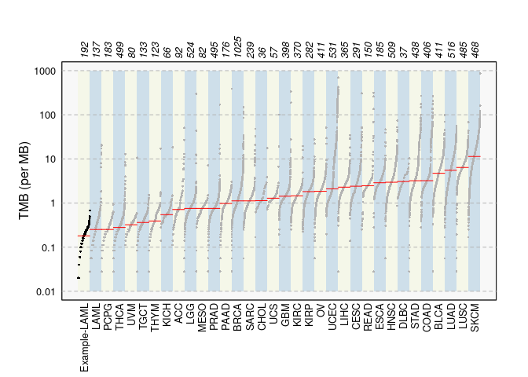<!-- -->

### Plotting VAF

The function ```plotVaf``` plots Variant Allele Frequencies as a boxplot which helps estimate clonal status of the top mutated genes. 


```r
plotVaf(maf = laml.maf, vafCol = 'i_TumorVAF_WU')
```

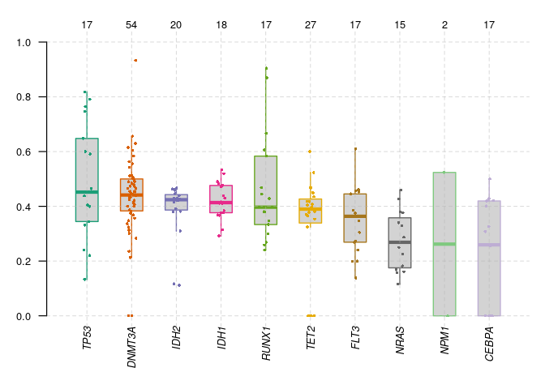<!-- -->

## Reading and summarizing gistic output files

Output files generated by the GISTIC program can be summarized. We need four files that are generated by GISTIC, all_lesions.conf_XX.txt, amp_genes.conf_XX.txt, del_genes.conf_XX.txt, and scores.gistic, where XX is the confidence level.  


```r
all.lesions <- system.file("extdata", "all_lesions.conf_99.txt", package = "maftools")
amp.genes <- system.file("extdata", "amp_genes.conf_99.txt", package = "maftools")
del.genes <- system.file("extdata", "del_genes.conf_99.txt", package = "maftools")
scores.gis <- system.file("extdata", "scores.gistic", package = "maftools")

laml.gistic = readGistic(gisticAllLesionsFile = all.lesions, gisticAmpGenesFile = amp.genes, gisticDelGenesFile = del.genes, gisticScoresFile = scores.gis, isTCGA = TRUE)
```

```
## -Processing Gistic files..
## --Processing amp_genes.conf_99.txt
## --Processing del_genes.conf_99.txt
## --Processing scores.gistic
## --Summarizing by samples
```


```r
laml.gistic
```

```
## An object of class  GISTIC 
##           ID summary
## 1:   Samples     191
## 2:    nGenes    2622
## 3: cytoBands      16
## 4:       Amp     388
## 5:       Del   26481
## 6:     total   26869
```

Similar to MAF objects, methods are available to access slots of the GISTIC object - ```getSampleSummary```, ```getGeneSummary```, and ```getCytoBandSummary```. The summarized results can be written to output files using the ```write.GisticSummary``` function.

## Visualizing gistic results

There are three types of plots that are available to visualize gistic results. 

### Genome plot


```r
gisticChromPlot(gistic = laml.gistic, markBands = "all")
```

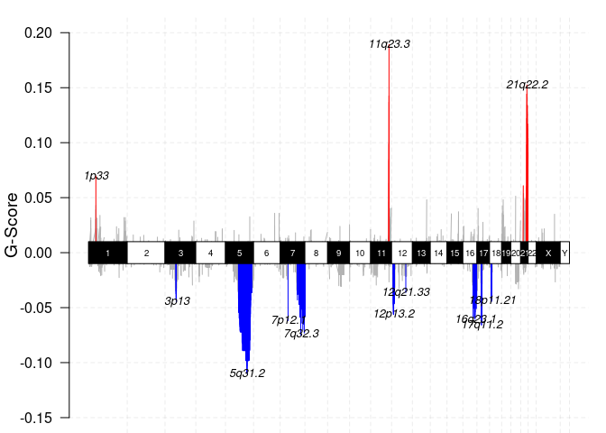<!-- -->

### Bubble plot


```r
gisticBubblePlot(gistic = laml.gistic)
```

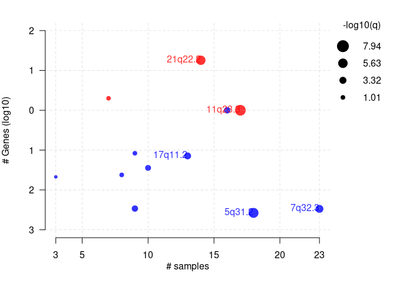<!-- -->

### Oncoplot

This is similar to oncoplots except for copy number data. The matrix can be sorted again according to any annotations. The plot below is the gistic results for LAML, sorted according to FAb classification. The plot shows that 7q deletions are basically absent in M4 subtype where as it is common in other subtypes. 


```r
gisticOncoPlot(gistic = laml.gistic, clinicalData = getClinicalData(x = laml.maf), clinicalFeatures = 'FAB_classification', sortByAnnotation = TRUE, top = 10)
```

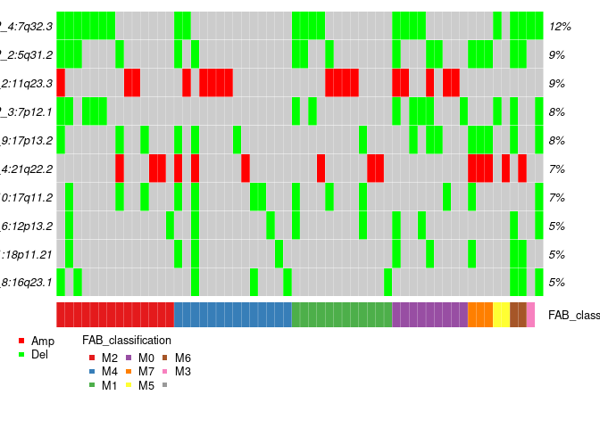<!-- -->

### Visualizing CBS segments


```r
tcga.ab.009.seg <- system.file("extdata", "TCGA.AB.3009.hg19.seg.txt", package = "maftools")
plotCBSsegments(cbsFile = tcga.ab.009.seg)
```

```
## NULL
```

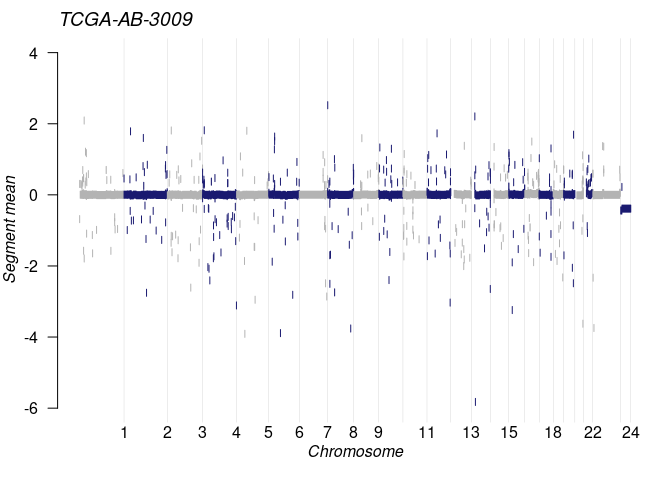<!-- -->

## Analysis

### Somatic Interactions

A co-occurring or mutually exclusive set of genes can be detected using the ```somaticInteractions``` function, which preforms pair-wise Fisher's exact test to detect these significant pair of genes. 


```r
#exclusive/co-occurance event analysis on top 10 mutated genes. 
somaticInteractions(maf = laml.maf, top = 25, pvalue = c(0.05, 0.1))
```

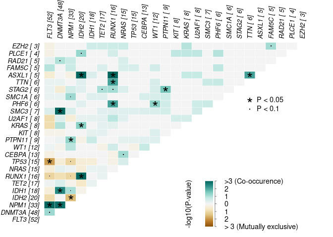<!-- -->

```
##      gene1  gene2       pValue oddsRatio  00 11 01 10        pAdj
##   1: ASXL1  RUNX1 0.0001541586 55.215541 176  4 12  1 0.003568486
##   2:  IDH2  RUNX1 0.0002809928  9.590877 164  7  9 13 0.006055880
##   3:  IDH2  ASXL1 0.0004030636 41.077327 172  4  1 16 0.008126283
##   4:  FLT3   NPM1 0.0009929836  3.763161 125 17 16 35 0.018664260
##   5:  SMC3 DNMT3A 0.0010451985 20.177713 144  6 42  1 0.018664260
##  ---                                                             
## 296: PLCE1  ASXL1 1.0000000000  0.000000 184  0  5  4 1.000000000
## 297: RAD21  FAM5C 1.0000000000  0.000000 183  0  5  5 1.000000000
## 298: PLCE1  FAM5C 1.0000000000  0.000000 184  0  5  4 1.000000000
## 299: PLCE1  RAD21 1.0000000000  0.000000 184  0  5  4 1.000000000
## 300:  EZH2  PLCE1 1.0000000000  0.000000 186  0  4  3 1.000000000
##                   Event         pair event_ratio
##   1:       Co_Occurence ASXL1, RUNX1        4/13
##   2:       Co_Occurence  IDH2, RUNX1        7/22
##   3:       Co_Occurence  ASXL1, IDH2        4/17
##   4:       Co_Occurence   FLT3, NPM1       17/51
##   5:       Co_Occurence DNMT3A, SMC3        6/43
##  ---                                            
## 296: Mutually_Exclusive ASXL1, PLCE1         0/9
## 297: Mutually_Exclusive FAM5C, RAD21        0/10
## 298: Mutually_Exclusive FAM5C, PLCE1         0/9
## 299: Mutually_Exclusive PLCE1, RAD21         0/9
## 300: Mutually_Exclusive  EZH2, PLCE1         0/7
```

### Detecting cancer driver genes based on positional clustering

The function ```oncodrive``` in maftools identifies cancer genes (driver) from a given MAF. ```oncodrive``` is based on an algorithm oncodriveCLUST, which was initially implemented using Python. The concept is based on the fact that most of the variants in cancer causing genes are enriched at a small number of specific loci or 'hot-spots'. This method takes advantage of these positions to identify cancer genes.


```r
laml.sig = oncodrive(maf = laml.maf, AACol = 'Protein_Change', minMut = 5, pvalMethod = 'zscore')
```

```
## 
  |                                                                            
  |                                                                      |   0%
  |                                                                            
  |===                                                                   |   4%
  |                                                                            
  |======                                                                |   9%
  |                                                                            
  |=========                                                             |  13%
  |                                                                            
  |============                                                          |  17%
  |                                                                            
  |===============                                                       |  22%
  |                                                                            
  |==================                                                    |  26%
  |                                                                            
  |=====================                                                 |  30%
  |                                                                            
  |========================                                              |  35%
  |                                                                            
  |===========================                                           |  39%
  |                                                                            
  |==============================                                        |  43%
  |                                                                            
  |=================================                                     |  48%
  |                                                                            
  |=====================================                                 |  52%
  |                                                                            
  |========================================                              |  57%
  |                                                                            
  |===========================================                           |  61%
  |                                                                            
  |==============================================                        |  65%
  |                                                                            
  |=================================================                     |  70%
  |                                                                            
  |====================================================                  |  74%
  |                                                                            
  |=======================================================               |  78%
  |                                                                            
  |==========================================================            |  83%
  |                                                                            
  |=============================================================         |  87%
  |                                                                            
  |================================================================      |  91%
  |                                                                            
  |===================================================================   |  96%
  |                                                                            
  |======================================================================| 100%
```


```r
head(laml.sig)
```

```
##    Hugo_Symbol Frame_Shift_Del Frame_Shift_Ins In_Frame_Del In_Frame_Ins
## 1:        IDH1               0               0            0            0
## 2:        IDH2               0               0            0            0
## 3:        NPM1               0              33            0            0
## 4:        NRAS               0               0            0            0
## 5:       U2AF1               0               0            0            0
## 6:         KIT               1               1            0            1
##    Missense_Mutation Nonsense_Mutation Splice_Site total MutatedSamples
## 1:                18                 0           0    18             18
## 2:                20                 0           0    20             20
## 3:                 1                 0           0    34             33
## 4:                15                 0           0    15             15
## 5:                 8                 0           0     8              8
## 6:                 7                 0           0    10              8
##    AlteredSamples clusters muts_in_clusters clusterScores protLen   zscore
## 1:             18        1               18     1.0000000     414 5.546154
## 2:             20        2               20     1.0000000     452 5.546154
## 3:             33        2               32     0.9411765     294 5.093665
## 4:             15        2               15     0.9218951     189 4.945347
## 5:              8        1                7     0.8750000     240 4.584615
## 6:              8        2                9     0.8500000     976 4.392308
##            pval          fdr fract_muts_in_clusters
## 1: 1.460110e-08 1.022077e-07              1.0000000
## 2: 1.460110e-08 1.022077e-07              1.0000000
## 3: 1.756034e-07 8.194826e-07              0.9411765
## 4: 3.800413e-07 1.330144e-06              1.0000000
## 5: 2.274114e-06 6.367520e-06              0.8750000
## 6: 5.607691e-06 1.308461e-05              0.9000000
```

We can plot these results using the function ```plotOncodrive```. This function will plot the results as a scatter plot with the size of the points are proportional to the number of clusters found in the gene. The x-axis shows the number of mutations (or fraction of mutations) observed in the clusters. In the below example, IDH1 has a single cluster and all of the 18 mutations are accumulated within that specific cluster, which gives it a cluster score of 1. 


```r
plotOncodrive(res = laml.sig, fdrCutOff = 0.1, useFraction = TRUE, labelSize = 0.5)
```

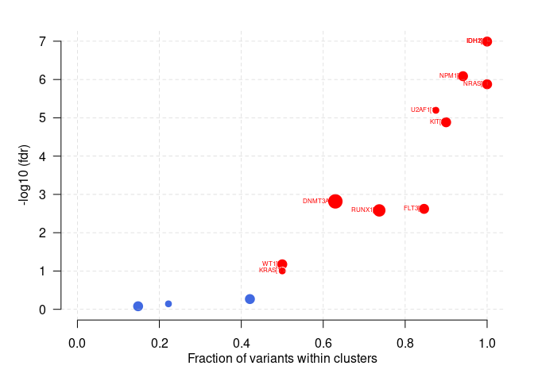<!-- -->

### Adding and summarizing pfam domains

The function ```pfamDomains`` in maftools adds pfam domain information to the amino acid changes. This function also summarizes amino acid changes according to the domains that are effected. This serves the purpose of knowing what domain in the given cancer cohort is the most frequently effected. This fucntion  was inspired from the Pfam annotation module from MuSic tool 8.


```r
laml.pfam = pfamDomains(maf = laml.maf, AACol = 'Protein_Change', top = 10)
```

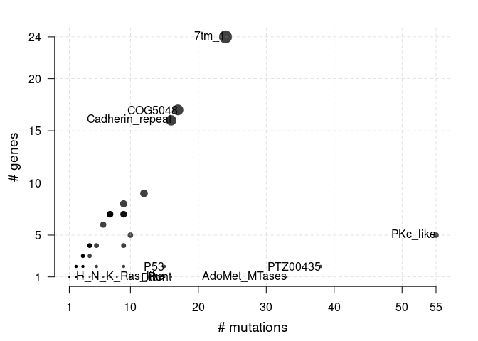<!-- -->


```r
#Protein summary (Printing first 7 columns for display convenience)
laml.pfam$proteinSummary[,1:7, with = FALSE]
```

```
##         HGNC AAPos Variant_Classification  N total  fraction   DomainLabel
##    1: DNMT3A   882      Missense_Mutation 27    54 0.5000000 AdoMet_MTases
##    2:   IDH1   132      Missense_Mutation 18    18 1.0000000      PTZ00435
##    3:   IDH2   140      Missense_Mutation 17    20 0.8500000      PTZ00435
##    4:   FLT3   835      Missense_Mutation 14    52 0.2692308      PKc_like
##    5:   FLT3   599           In_Frame_Ins 10    52 0.1923077      PKc_like
##   ---                                                                     
## 1512: ZNF646   875      Missense_Mutation  1     1 1.0000000          <NA>
## 1513: ZNF687   554      Missense_Mutation  1     2 0.5000000          <NA>
## 1514: ZNF687   363      Missense_Mutation  1     2 0.5000000          <NA>
## 1515: ZNF75D     5      Missense_Mutation  1     1 1.0000000          <NA>
## 1516: ZNF827   427        Frame_Shift_Del  1     1 1.0000000          <NA>
```


```r
#Domain summary (Printing first 3 columns for display convenience)
laml.pfam$domainSummary[,1:3, with = FALSE]
```

```
##        DomainLabel nMuts nGenes
##   1:      PKc_like    55      5
##   2:      PTZ00435    38      2
##   3: AdoMet_MTases    33      1
##   4:         7tm_1    24     24
##   5:       COG5048    17     17
##  ---                           
## 499:    ribokinase     1      1
## 500:   rim_protein     1      1
## 501: sigpep_I_bact     1      1
## 502:           trp     1      1
## 503:        zf-BED     1      1
```

### Survival analysis

The survival analysis is an essential part of cohort based sequencing projects. The function ```mafSurvive``` preforms a survival analysis and draws kaplan meire curve by grouping samples based on mutation status of user defined genes or manually provided samples that  make up a group. This function requires input data to contain Tumor_Sample_Barcode, binary event and time event. If you have survival data stored in a seperate table they can be provided by using the argument ```clinicalData```. 

#### Mutation in any given genes


```r
#Survival analysis based on grouping of DNMT3A mutation status
mafSurvival(maf = laml.maf, genes = 'DNMT3A', time = 'days_to_last_followup', Status = 'Overall_Survival_Status', isTCGA = TRUE)
```

```
## DNMT3A 
##     48 
##     Group medianTime   N
## 1: Mutant        245  45
## 2:     WT        396 137
```

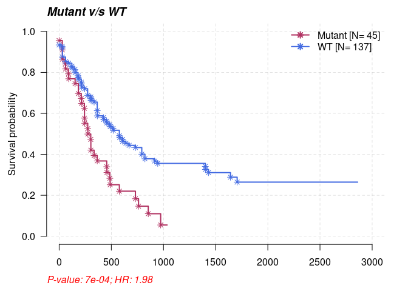<!-- -->

#### Predict genestes associated with survival

Identifies the set od genes which results in poor survival.


```r
#Using top 20 mutated genes to identify a set of genes (of size 2) to predict poor prognostic groups
prog_geneset = survGroup(maf = laml.maf, top = 20, geneSetSize = 2, time = "days_to_last_followup", Status = "Overall_Survival_Status", verbose = FALSE)
```


```r
print(prog_geneset)
```

```
##     Gene_combination P_value    hr  WT Mutant
##  1:      FLT3_DNMT3A 0.00104 2.510 164     18
##  2:      DNMT3A_SMC3 0.04880 2.220 176      6
##  3:      DNMT3A_NPM1 0.07190 1.720 166     16
##  4:      DNMT3A_TET2 0.19600 1.780 176      6
##  5:        FLT3_TET2 0.20700 1.860 177      5
##  6:        NPM1_IDH1 0.21900 0.495 176      6
##  7:      DNMT3A_IDH1 0.29300 1.500 173      9
##  8:       IDH2_RUNX1 0.31800 1.580 176      6
##  9:        FLT3_NPM1 0.53600 1.210 165     17
## 10:      DNMT3A_IDH2 0.68000 0.747 178      4
## 11:      DNMT3A_NRAS 0.99200 0.986 178      4
```

The above results show a combination (N = 2) of genes which are associated with poor survival rates (P < 0.05). We can draw a KM curve for the above rsults by using the function ```mafSurvGroup```.


```r
mafSurvGroup(maf = laml.maf, geneSet = c("DNMT3A", "FLT3"), time = "days_to_last_followup", Status = "Overall_Survival_Status")
```

```
##     Group medianTime   N
## 1: Mutant      242.5  18
## 2:     WT      379.5 164
```

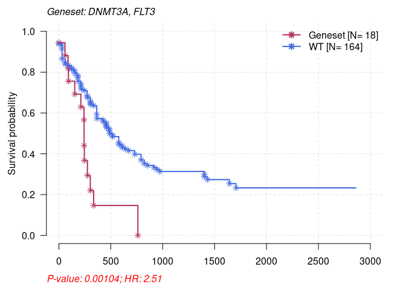<!-- -->

### Comparing two cohorts (MAFs)

Cancers are different from each other by their mutation patterns. Two different cohorts can be compared to detect differentially mutated genes. This difference can be detected by using the function ```mafCompare```, which preforms fisher test on all genes between two cohorts to detect differentially mutated genes.


```r
#Primary APL MAF
primary.apl = system.file("extdata", "APL_primary.maf.gz", package = "maftools")
primary.apl = read.maf(maf = primary.apl)
```

```
## -Reading
## -Validating
## --Non MAF specific values in Variant_Classification column:
##   ITD
## -Silent variants: 45 
## -Summarizing
## -Processing clinical data
## --Missing clinical data
## -Finished in 0.087s elapsed (0.100s cpu)
```

```r
#Relapse APL MAF
relapse.apl = system.file("extdata", "APL_relapse.maf.gz", package = "maftools")
relapse.apl = read.maf(maf = relapse.apl)
```

```
## -Reading
## -Validating
## --Non MAF specific values in Variant_Classification column:
##   ITD
## -Silent variants: 19 
## -Summarizing
## -Processing clinical data
## --Missing clinical data
## -Finished in 0.051s elapsed (0.078s cpu)
```

```r
#Considering only genes which are mutated in at-least in 5 samples in one of the cohort to avoid bias due to genes mutated in single sample.
pt.vs.rt <- mafCompare(m1 = primary.apl, m2 = relapse.apl, m1Name = 'Primary', m2Name = 'Relapse', minMut = 5)
print(pt.vs.rt)
```

```
## $results
##    Hugo_Symbol Primary Relapse         pval         or       ci.up      ci.low
## 1:         PML       1      11 1.529935e-05 0.03537381   0.2552937 0.000806034
## 2:        RARA       0       7 2.574810e-04 0.00000000   0.3006159 0.000000000
## 3:       RUNX1       1       5 1.310500e-02 0.08740567   0.8076265 0.001813280
## 4:        FLT3      26       4 1.812779e-02 3.56086275  14.7701728 1.149009169
## 5:      ARID1B       5       8 2.758396e-02 0.26480490   0.9698686 0.064804160
## 6:         WT1      20      14 2.229087e-01 0.60619329   1.4223101 0.263440988
## 7:        KRAS       6       1 4.334067e-01 2.88486293 135.5393108 0.337679367
## 8:        NRAS      15       4 4.353567e-01 1.85209500   8.0373994 0.553883512
## 9:      ARID1A       7       4 7.457274e-01 0.80869223   3.9297309 0.195710173
##         adjPval
## 1: 0.0001376942
## 2: 0.0011586643
## 3: 0.0393149868
## 4: 0.0407875250
## 5: 0.0496511201
## 6: 0.3343630535
## 7: 0.4897762916
## 8: 0.4897762916
## 9: 0.7457273717
## 
## $SampleSummary
##     Cohort SampleSize
## 1: Primary        124
## 2: Relapse         58
```

#### Forest plots

The results above show two genes PML and RARA which are highly mutated in Relapse APL comapred to Primary APL. These results can be visualized as a forestplot. 


```r
forestPlot(mafCompareRes = pt.vs.rt, pVal = 0.1)
```

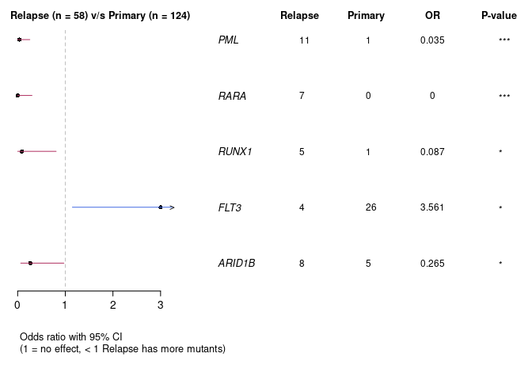<!-- -->

#### Co-onco plots

Another way of displaying the results above is by plotting two oncoplots side by side. The ```coOncoplot``` function takes two maf objects and plots them side by side for a better comparison. 


```r
genes = c("PML", "RARA", "RUNX1", "ARID1B", "FLT3")
coOncoplot(m1 = primary.apl, m2 = relapse.apl, m1Name = 'PrimaryAPL', m2Name = 'RelapseAPL', genes = genes, removeNonMutated = TRUE)
```

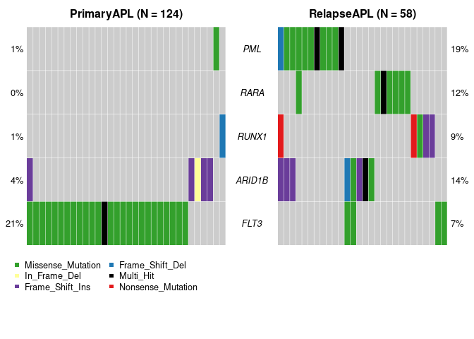<!-- -->

#### Co-bar plots


```r
coBarplot(m1 = primary.apl, m2 = relapse.apl, m1Name = "Primary", m2Name = "Relapse")
```

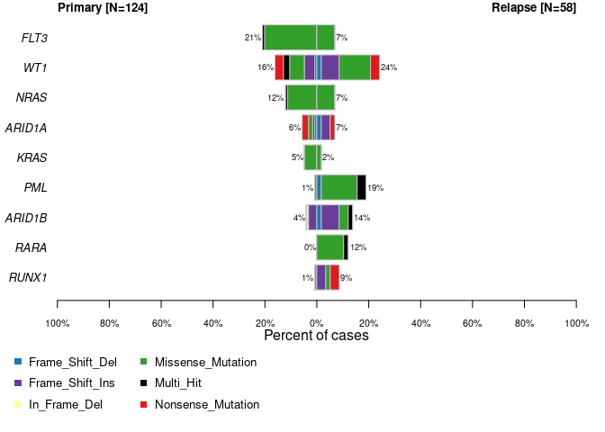<!-- -->

#### Lollipop plot-2

Along with plots that show cohort wise differences, it is possible to also shoe gene wise differences with the ```lollipopPlot2``` function. 


```r
lollipopPlot2(m1 = primary.apl, m2 = relapse.apl, gene = "PML", AACol1 = "amino_acid_change", AACol2 = "amino_acid_change", m1_name = "Primary", m2_name = "Relapse")
```

```
##    HGNC refseq.ID protein.ID aa.length
## 1:  PML NM_002675  NP_002666       633
## 2:  PML NM_033238  NP_150241       882
## 3:  PML NM_033239  NP_150242       829
## 4:  PML NM_033240  NP_150243       611
## 5:  PML NM_033244  NP_150247       560
## 6:  PML NM_033246  NP_150249       423
## 7:  PML NM_033247  NP_150250       435
## 8:  PML NM_033249  NP_150252       585
## 9:  PML NM_033250  NP_150253       781
##    HGNC refseq.ID protein.ID aa.length
## 1:  PML NM_002675  NP_002666       633
## 2:  PML NM_033238  NP_150241       882
## 3:  PML NM_033239  NP_150242       829
## 4:  PML NM_033240  NP_150243       611
## 5:  PML NM_033244  NP_150247       560
## 6:  PML NM_033246  NP_150249       423
## 7:  PML NM_033247  NP_150250       435
## 8:  PML NM_033249  NP_150252       585
## 9:  PML NM_033250  NP_150253       781
```

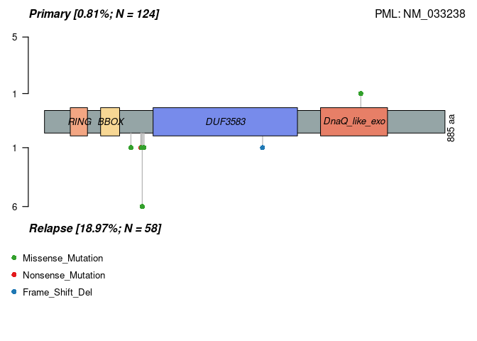<!-- -->

### Clinical enrichment analysis

The function ```clinicalEnrichment``` takes any clinical feature associated with the samples and preforms enrichment analysis. It will preform pairwise and groupwise comparisons to identify enriched mutations for each category in a clinical feature. The example below shows identification of mutations associated with FAB_classification. 


```r
fab.ce = clinicalEnrichment(maf = laml.maf, clinicalFeature = 'FAB_classification')
```

```
## 
## M0 M1 M2 M3 M4 M5 M6 M7 
## 19 44 44 21 39 19  3  3
```


```r
#Results are returned as a list. Significant associations p-value < 0.05
fab.ce$groupwise_comparision[p_value < 0.05]
```

```
##    Hugo_Symbol Group1 Group2 n_mutated_group1 n_mutated_group2      p_value
## 1:        IDH1     M1   Rest         11 of 44         7 of 149 0.0002597371
## 2:        TP53     M7   Rest           3 of 3        12 of 190 0.0003857187
## 3:      DNMT3A     M5   Rest         10 of 19        38 of 174 0.0089427384
## 4:       CEBPA     M2   Rest          7 of 44         6 of 149 0.0117352110
## 5:       RUNX1     M0   Rest          5 of 19        11 of 174 0.0117436825
## 6:        NPM1     M5   Rest          7 of 19        26 of 174 0.0248582372
## 7:        NPM1     M3   Rest          0 of 21        33 of 172 0.0278630823
## 8:      DNMT3A     M3   Rest          1 of 21        47 of 172 0.0294005111
##          OR      OR_low    OR_high       fdr
## 1: 6.670592 2.173829026 21.9607250 0.0308575
## 2:      Inf 5.355415451        Inf 0.0308575
## 3: 3.941207 1.333635173 11.8455979 0.3757978
## 4: 4.463237 1.204699322 17.1341278 0.3757978
## 5: 5.216902 1.243812880 19.4051505 0.3757978
## 6: 3.293201 1.001404899 10.1210509 0.5880102
## 7: 0.000000 0.000000000  0.8651972 0.5880102
## 8: 0.133827 0.003146708  0.8848897 0.5880102
```

The results above show IDH1 mutations are enriched in the M1 subtype of leukemia as compared to the rest of the cohort, as well as DNMT3A is in M5, RUNX1 is in M0, and so on. These results are well known and the function captures them. Any kind of clinical feature can be used to preform these analyses. The small function ```plotEnrichmentResults``` can be used to plot the results. 


```r
plotEnrichmentResults(enrich_res = fab.ce, pVal = 0.05, geneFontSize = 0.5, annoFontSize = 0.6)
```

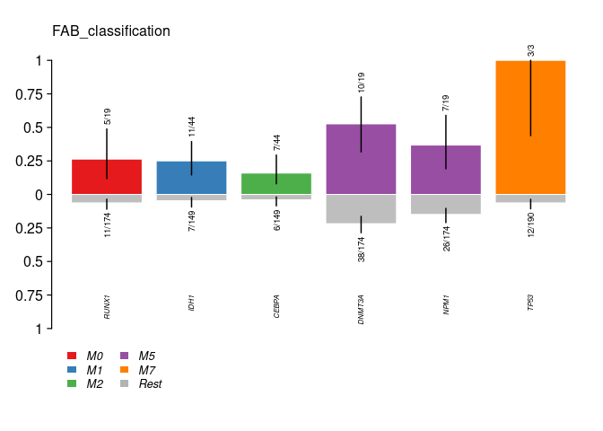<!-- -->

### Drug-Gene Interactions

The function ```drugInteractions``` checks for drug-gene interactions and gene drugability information that has been compiled from the Drug Gene Interaction database. 


```r
dgi = drugInteractions(maf = laml.maf, fontSize = 0.75)
```

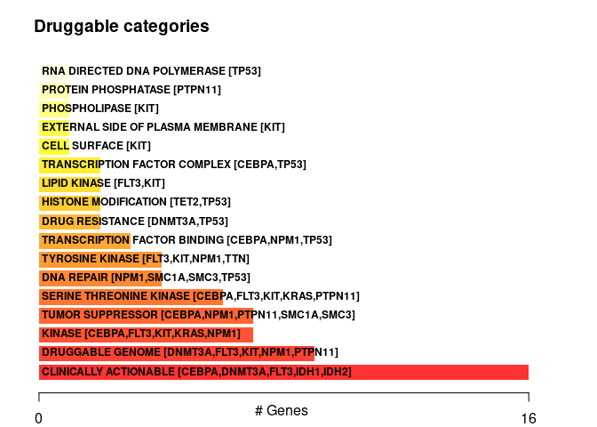<!-- -->

The plot above shows potential drugable gene categories, with the top five genes involved in them. Drug-gene interaction information can also be extracted. Below shows the results for drugs that interacts with DNMT3A.


```r
dnmt3a.dgi = drugInteractions(genes = "DNMT3A", drugs = TRUE)
```

```
## Number of claimed drugs for given genes:
##      Gene N
## 1: DNMT3A 7
```


```r
#Printing selected columns.
dnmt3a.dgi[,.(Gene, interaction_types, drug_name, drug_claim_name)]
```

```
##      Gene interaction_types    drug_name drug_claim_name
## 1: DNMT3A                                            N/A
## 2: DNMT3A                   DAUNORUBICIN    Daunorubicin
## 3: DNMT3A                     DECITABINE      Decitabine
## 4: DNMT3A                     IDARUBICIN      IDARUBICIN
## 5: DNMT3A                     DECITABINE      DECITABINE
## 6: DNMT3A         inhibitor   DECITABINE   CHEMBL1201129
## 7: DNMT3A         inhibitor  AZACITIDINE      CHEMBL1489
```

### Oncogenic Signaling Pathways

The function ```OncogenicPathways``` checks for the enrichment of known Oncogenic Signaling Pathways in TCGA cohorts.


```r
OncogenicPathways(maf = laml.maf)
```

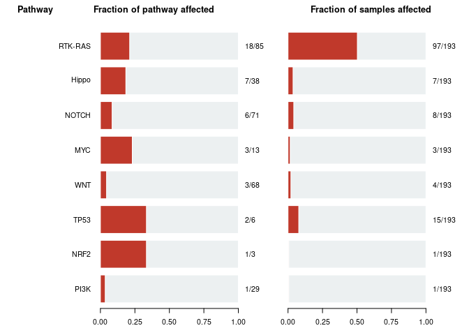<!-- -->

```
##    Pathway  N n_affected_genes fraction_affected Mutated_samples
## 1:    PI3K 29                1        0.03448276               1
## 2:    NRF2  3                1        0.33333333               1
## 3:    TP53  6                2        0.33333333              15
## 4:     WNT 68                3        0.04411765               4
## 5:     MYC 13                3        0.23076923               3
## 6:   NOTCH 71                6        0.08450704               8
## 7:   Hippo 38                7        0.18421053               7
## 8: RTK-RAS 85               18        0.21176471              97
##    Fraction_mutated_samples
## 1:              0.005181347
## 2:              0.005181347
## 3:              0.077720207
## 4:              0.020725389
## 5:              0.015544041
## 6:              0.041450777
## 7:              0.036269430
## 8:              0.502590674
```

This function can also visualized the complete pathway. Tumor suppressor genes are shown in red, and oncogenes in blue font.


```r
PlotOncogenicPathways(maf = laml.maf, pathways = "RTK-RAS")
```

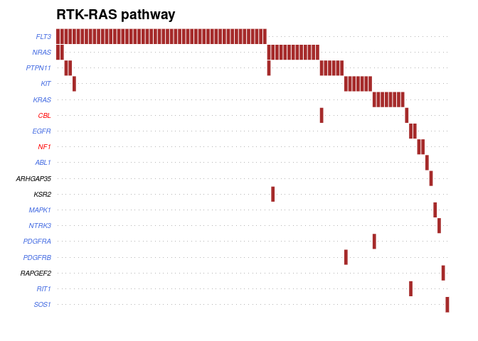<!-- -->

### Mutual Signatures

All types of cancer leave a signature that is characterized by a singe pattern of nucleotide substitutions. These signatures can be extracted by decomposing matrix of nucleotide substitutions, which are classified into 96 classes based on the immediate bases that surround the mutated base. The first step in a signature analysis is the obtain the adjacent based that are surrounding the mutated base and form a mutation matrix. 


```r
#Requires BSgenome object
library("BSgenome.Hsapiens.UCSC.hg19", quietly = TRUE)
```


```r
laml.tnm = trinucleotideMatrix(maf = laml.maf, prefix = 'chr', add = TRUE, ref_genome = "BSgenome.Hsapiens.UCSC.hg19")
```

```
## -Extracting 5' and 3' adjacent bases
## -Extracting +/- 20bp around mutated bases for background C>T estimation
## -Estimating APOBEC enrichment scores
## --Performing one-way Fisher's test for APOBEC enrichment
## ---APOBEC related mutations are enriched in  3.315 % of samples (APOBEC enrichment score > 2 ;  6  of  181  samples)
## -Creating mutation matrix
## --matrix of dimension 188x96
```

The function above preforms two steps:

* Estimates the APOBEC enrichment scores
* Prepares a mutational matrix analysis

#### APOBEC Enrichment estimation

Mutations induced by APOBEC are more frequent in soil tumors and are associated with C>T transitions occurring in th TCW motif. The enrichment of >T mutations that have occurred in the TCW motif are compared to background Cytosines and TCWs within 20bp of mutated bases. A one-sided fishers exact test is also preformed to statistically evaluate the enrichment score. 

#### Differences between APOBEC enriched and non-enriched samples

Differences in mutational patters between APOBEC enriched and non-APOBEC enriched samples can also be analysed. The function ```plotApobecDiff``` takes APOBEC enrichment scored estimated by ```trinucleotideMatrix``` and classified the samples into APOBEC or non-APOBEC enriched. After stratification, it compared the two groups to identify differentially altered genes.


```r
plotApobecDiff(tnm = laml.tnm, maf = laml.maf, pVal = 0.2)
```

```
## -Processing clinical data
## -Processing clinical data
```

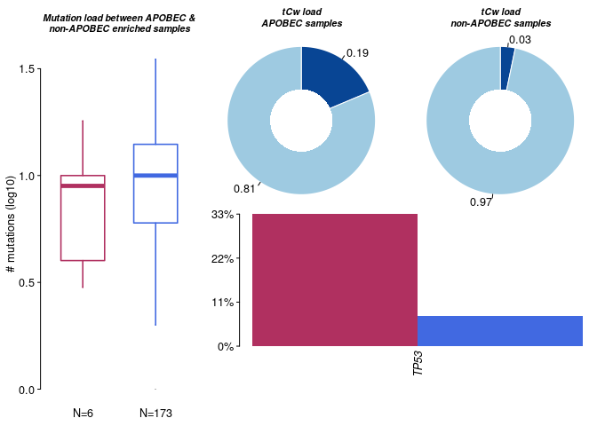<!-- -->

```
## $results
##      Hugo_Symbol Enriched nonEnriched       pval        or      ci.up
##   1:        TP53        2          13 0.08175632 5.9976455  46.608861
##   2:        TET2        1          16 0.45739351 1.9407002  18.983979
##   3:        FLT3        2          45 0.65523131 1.4081851  10.211621
##   4:      DNMT3A        1          47 1.00000000 0.5335362   4.949499
##   5:      ADAM11        0           2 1.00000000 0.0000000 164.191472
##  ---                                                                 
## 132:         WAC        0           2 1.00000000 0.0000000 164.191472
## 133:         WT1        0          12 1.00000000 0.0000000  12.690862
## 134:      ZBTB33        0           2 1.00000000 0.0000000 164.191472
## 135:      ZC3H18        0           2 1.00000000 0.0000000 164.191472
## 136:      ZNF687        0           2 1.00000000 0.0000000 164.191472
##          ci.low adjPval
##   1: 0.49875432       1
##   2: 0.03882963       1
##   3: 0.12341748       1
##   4: 0.01101929       1
##   5: 0.00000000       1
##  ---                   
## 132: 0.00000000       1
## 133: 0.00000000       1
## 134: 0.00000000       1
## 135: 0.00000000       1
## 136: 0.00000000       1
## 
## $SampleSummary
##         Cohort SampleSize  Mean Median
## 1:    Enriched          6 7.167    6.5
## 2: nonEnriched        172 9.715    9.0
```

#### Signature analysis

A signature analysis includes the following steps:

* ```estimateSignatues``` - runs NMF on a range of values and measures the goodness of fit (Cophenetic correlation)
* ```plotCophenetic``` - draws an elbow plot and helps decide the optimal number of signatures - the best possible signature is the value at which the Cophenetic correlation has a significant drop
* ```extractSignatures``` - uses non-negative matrix into ```n``` signatures based on the two steps above
* ```compareSIgnatures``` - extract signatures from above step which can be compared to known signatures from COSMIC database, and cosine similarity is calculated to identify the best match
* ```plotSignaturs``` - plots signatures


```r
library('NMF')
laml.sign = estimateSignatures(mat = laml.tnm, nTry = 6, pConstant = 0.1)
```

```
## -Running NMF for 6 ranks
## Compute NMF rank= 2  ... + measures ... OK
## Compute NMF rank= 3  ... + measures ... OK
## Compute NMF rank= 4  ... + measures ... OK
## Compute NMF rank= 5  ... + measures ... OK
## Compute NMF rank= 6  ... + measures ... OK
```

```
## -Finished in 38.8s elapsed (8.281s cpu)
```

```r
plotCophenetic(res = laml.sign)
```

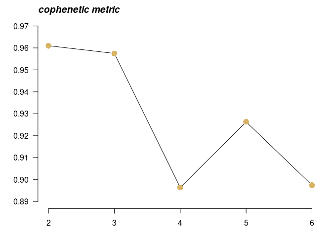<!-- -->

The best possible value is the one at which the correlation value on the y-axis drops significantly. According to the graph above, it appears to be at ```n = 3```. LAML is not the most ideal example for signature analysis due to its low mutation rate, but it has a sufficient number of samples.

When ```n``` is estimated, the main function can be ran.


```r
laml.sig = extractSignatures(mat = laml.tnm, n = 3, pConstant = 0.1)
```

Compare detected signatures to COSMIC Legacy or SBS signature database. 


```r
#Compate against original 30 signatures 
laml.og30.cosm = compareSignatures(nmfRes = laml.sig, sig_db = "legacy")
```


```r
#Compate against updated version3 60 signatures 
laml.v3.cosm = compareSignatures(nmfRes = laml.sig, sig_db = "SBS")
```

The function ```compareSignatures``` returns a full table of cosine similarities against COSMIC signatures, to be further analysed. The plot below shows the similarities of detected signatures against validated signatures.


```r
library('pheatmap')
pheatmap::pheatmap(mat = laml.og30.cosm$cosine_similarities, cluster_rows = FALSE, main = "cosine similarity against validated signatures")
```

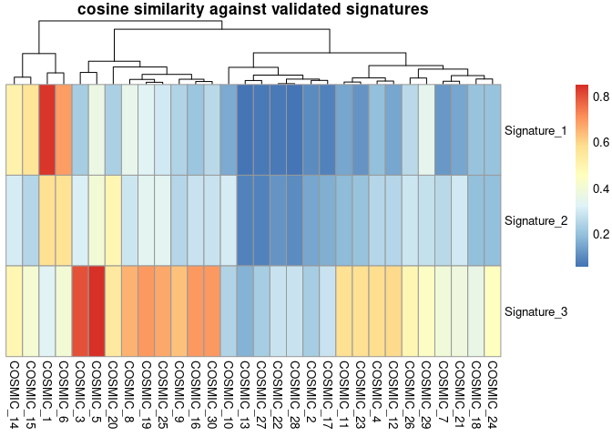<!-- -->

Finally, plot the signatures.


```r
maftools::plotSignatures(nmfRes = laml.sig, title_size = 1.2, sig_db = "SBS")
```

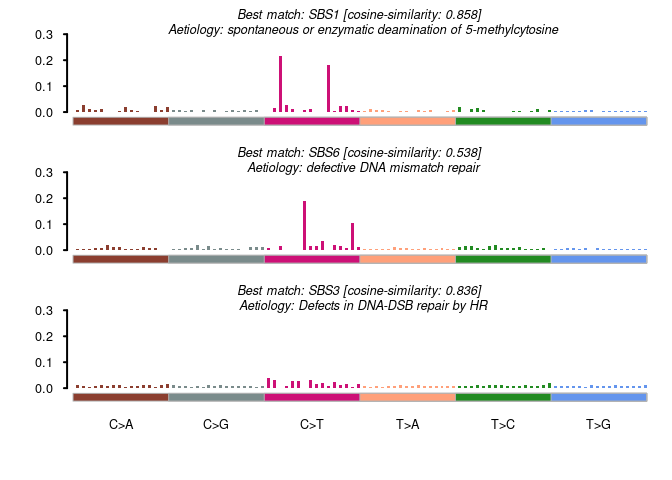<!-- -->

You can install ```barplot3d``` package and visualize the results with ```legoplot3d``` function to get a 3D plot.


```r
library("barplot3d")
#Visualize first signature
sig1 = laml.sig$signatures[,1]
barplot3d::legoplot3d(contextdata = sig1, labels = FALSE, scalexy = 0.01, sixcolors = "sanger", alpha = 0.5)
```

## Citation

Madan, V. et al. Comprehensive mutational analysis of primary and relapse acute promyelocytic leukemia. Leukemia 30, 1672-81 (2016).

Mayakonda A, Lin DC, Assenov Y, Plass C, Koeffler HP. 2018. Maftools: efficient and comprehensive analysis of somatic variants in cancer. Genome Resarch. PMID: 30341162

David Tamborero, Abel Gonzalez-Perez, Nuria Lopez-Bigas, OncodriveCLUST: exploiting the positional clustering of somatic mutations to identify cancer genes, Bioinformatics, Volume 29, Issue 18, 15 September 2013, Pages 2238–2244, https://doi.org/10.1093/bioinformatics/btt395

